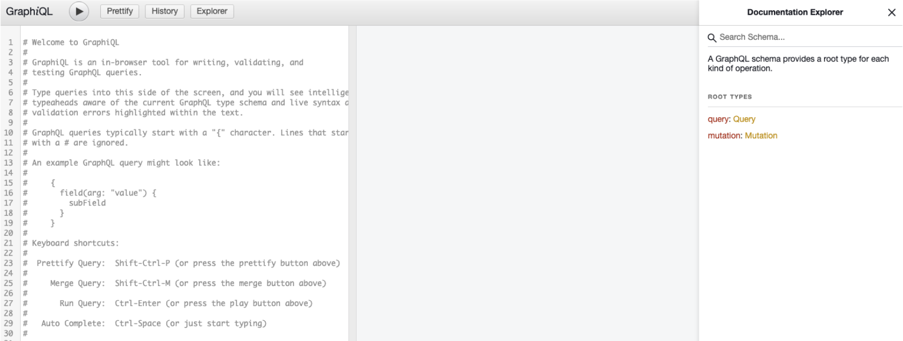
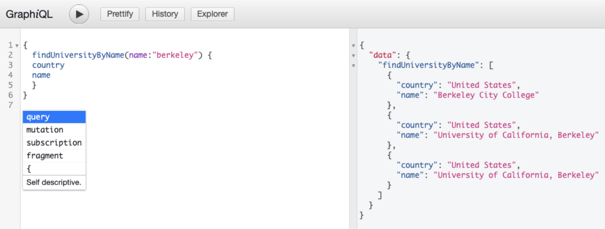

# University Domains List API REST Adapter

This is an example REST adapter for Graph Quilt's Gateway.  

### Registering in a local running GraphQL Quilt gateway 

1. Start GraphQL Quilt Gateway.  Follow instructions [here](https://github.com/graph-quilt/graph-quilt-gateway/blob/master/README.md) 
2. Clone this repository `git clone https://github.com/CNAChino/university-api-graphql-adapter.git`
3. cd university-api-graphql-adapter/
4. ./register.sh

You should see the following logs:

```
Updating topics bucket with registry from ./dev folder
upload: dev/registrations/1.0.0/universities.api.adapter/main/config.json to s3://topics/graphql-gateway/dev/registrations/1.0.0/universities.api.adapter/main/config.json
upload: dev/registrations/1.0.0/universities.api.adapter/main/graphql/schema.graphqls to s3://topics/graphql-gateway/dev/registrations/1.0.0/universities.api.adapter/main/graphql/schema.graphqls
upload: dev/registrations/1.0.0/universities.api.adapter/main/flow/service.flow to s3://topics/graphql-gateway/dev/registrations/1.0.0/universities.api.adapter/main/flow/service.flow
Registry setup completed
```

Now wait for the the schema to get loaded by graphql gateway which polls registrations from localstack-S3.


### Test with GraphiQL

To check if the schema has been updated, go to http://localhost:7000/graphiql, you should see:



Click on Query type on the right hand side, then you should see the findUniversityByName field name:

Then run this query

```
{
  findUniversityByName(name:"berkeley") {
    country
    name
  }
}
```

and you should see the response.


